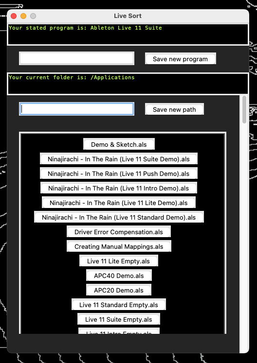

Yo welcome to **Sort for Ableton Live**. 

I made this because I thought I'd be a handy tool. There might be extensions in the future for further functionality.

I think the programm is pretty much self-explanatory. 

You open it and enter the path to a folder. For example `/Users/AngelaMerkel/Music/Ableton_Files`. Ideally there are **.als** files in there. If not it will let you know. 

You have to enter the Live Version you are using. For example **Ableton Live 11 Suite**. If you enter a wrong program-name the files can't be opend.

The existing Live Files will be displayed and sorted by the time of the last edit. The 175 most recently edited files will be displayed.

The program looks like this:

**How to install it:**

To download it click on 'Code' and 'Download ZIP'.

Extract the Folder and put it in the Applications Directory. Change the name of the Folder to **LiveSort**.

To actually run the application you need to install **Python3** (it's not to complicated). You can download it via this link: [Python](https://www.python.org/downloads/) or install it with Homebrew via: `brew install python@3.12`.

When you installed Python3 you can just click the **exec File (Ableton_Live_Sort)** which will run the python code. You can create an alias and put it on your desktop so you can open the app real quick. ⚡️😼 I also included two lil graphics I made. Feel free to use them as the icon for the Alias!

If you want to run the code from the terminal for whatever reason, you have to open a terminal at the folder (the folder in which the code is) and run `python3 abl_sort_main.py`.

If you want to put the Folder into another directory you have to modify the **Ableton_Live_Sort.c** file, meaning you need to change the given paths in the file. Afterwards you need to compile the file. You can use the makefile for that, which is using clang to compile.

If you want to run the exec file on a windows system you have to modify **Ableton_Live_Sort.c** since its using an AppleScript and the given paths are not correct on Windows.

If you find a bug or want to participate on the repository let me know 💋